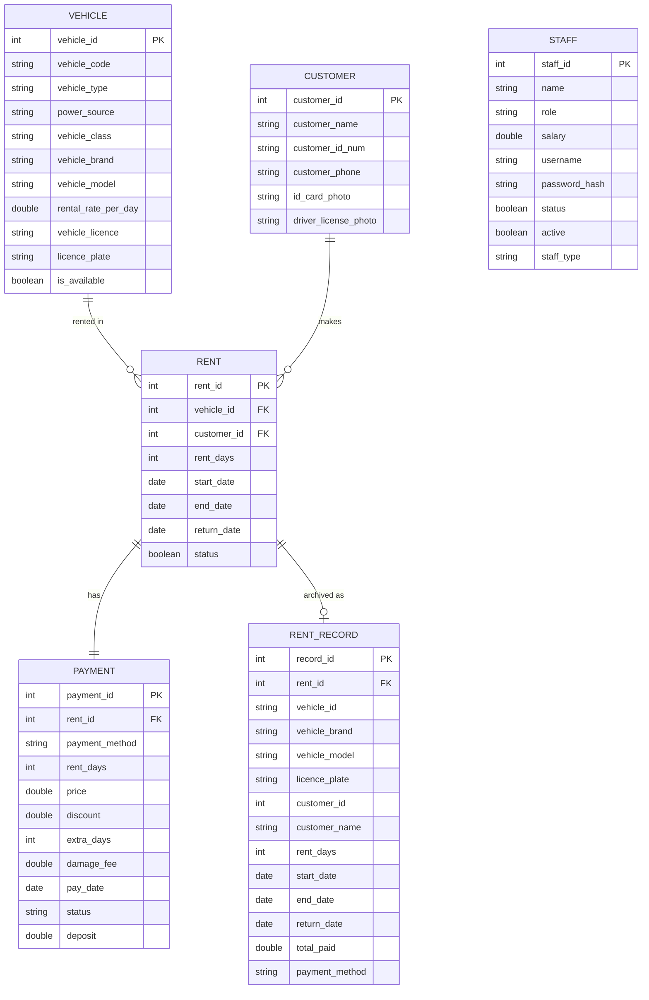

# Database Design for Vehicle Rental Management System

Based on your existing Java classes, here's the complete database schema and the JPA/Hibernate cheat code to auto-generate it.

---

## ER Diagram



---

## Table Definitions

### 1. `vehicle` — Single Table Inheritance for `Car` + `Moto`

Since `Car` and `Moto` share **identical fields**, use one table with a `vehicle_type` discriminator.

| Column | Type | Constraint | Maps From |
|---|---|---|---|
| `vehicle_id` | `INT` | PK, AUTO_INCREMENT | — |
| `vehicle_code` | `VARCHAR(20)` | UNIQUE, NOT NULL | `vehicleId` ("Car-1", "Moto-1") |
| `vehicle_type` | `VARCHAR(10)` | NOT NULL | Discriminator: `CAR` / `MOTO` |
| `power_source` | `VARCHAR(20)` | | `powerSource` |
| `vehicle_class` | `VARCHAR(30)` | | `vehicleClass` |
| `vehicle_brand` | `VARCHAR(50)` | NOT NULL | `vehicleBrand` |
| `vehicle_model` | `VARCHAR(50)` | NOT NULL | `vehicleModel` |
| `rental_rate_per_day` | `DECIMAL(10,2)` | NOT NULL, CHECK ≥ 0 | `rentalRatePerDay` |
| `vehicle_licence` | `VARCHAR(30)` | | `vehicleLicence` |
| `licence_plate` | `VARCHAR(20)` | UNIQUE, NOT NULL | `licencePlate` |
| `is_available` | `BOOLEAN` | DEFAULT TRUE | `isAvailable` |

> [!TIP]
> Your `Car` and `Moto` classes are structurally identical. In JPA, this becomes `@Inheritance(strategy = InheritanceType.SINGLE_TABLE)` with `@DiscriminatorColumn(name = "vehicle_type")`.

---

### 2. `customer`

| Column | Type | Constraint | Maps From |
|---|---|---|---|
| `customer_id` | `INT` | PK, AUTO_INCREMENT | `customerId` |
| `customer_name` | `VARCHAR(100)` | NOT NULL | `customerName` |
| `customer_id_num` | `VARCHAR(30)` | UNIQUE, NOT NULL | `customerIdNum` |
| `customer_phone` | `VARCHAR(10)` | UNIQUE, NOT NULL | `customerPhone` |
| `id_card_photo` | `VARCHAR(255)` | NULLABLE | `IDCardPhoto` |
| `driver_license_photo` | `VARCHAR(255)` | NULLABLE | `DriverLicensePhoto` |

---

### 3. `staff` — Single Table Inheritance for `Staff` + `ManagerStaff`

Same logic — both classes have identical fields, only `can()` permission differs.

| Column | Type | Constraint | Maps From |
|---|---|---|---|
| `staff_id` | `INT` | PK, AUTO_INCREMENT | `staffId` |
| `staff_type` | `VARCHAR(15)` | NOT NULL | Discriminator: `STAFF` / `MANAGER` |
| `name` | `VARCHAR(100)` | NOT NULL | `name` |
| `role` | `VARCHAR(50)` | NOT NULL | `role` |
| `salary` | `DECIMAL(10,2)` | CHECK ≥ 0 | `salary` |
| `username` | `VARCHAR(50)` | UNIQUE, NOT NULL | `username` |
| `password_hash` | `VARCHAR(255)` | NOT NULL | `password` (hash it!) |
| `status` | `BOOLEAN` | DEFAULT TRUE | `status` (employed?) |
| `active` | `BOOLEAN` | DEFAULT FALSE | `active` (online?) |

> [!CAUTION]
> **Never store plain-text passwords in a database.** Use `BCryptPasswordEncoder` from Spring Security. Your current code stores passwords as raw strings — this must change when moving to a DB.

---

### 4. `rent`

| Column | Type | Constraint | Maps From |
|---|---|---|---|
| `rent_id` | `INT` | PK, AUTO_INCREMENT | `rentId` |
| `vehicle_id` | `INT` | FK → `vehicle.vehicle_id`, NOT NULL | `vehicle` |
| `customer_id` | `INT` | FK → `customer.customer_id`, NOT NULL | `customer` |
| `rent_days` | `INT` | NOT NULL, CHECK > 0 | `rentDays` |
| `start_date` | `DATE` | NOT NULL | `startDate` |
| `end_date` | `DATE` | NOT NULL | `endDate` |
| `return_date` | `DATE` | NULLABLE | `returnDate` |
| `status` | `BOOLEAN` | DEFAULT TRUE | `status` (active/completed) |

**Relationships:**
- `@ManyToOne` → `Vehicle`
- `@ManyToOne` → `Customer`
- `@OneToOne(mappedBy)` → `Payment`

---

### 5. `payment`

| Column | Type | Constraint | Maps From |
|---|---|---|---|
| `payment_id` | `INT` | PK, AUTO_INCREMENT | `paymentId` |
| `rent_id` | `INT` | FK → `rent.rent_id`, UNIQUE | linked via `Rent` |
| `payment_method` | `VARCHAR(20)` | | `paymentMethod` |
| `rent_days` | `INT` | | `rentDays` |
| `price` | `DECIMAL(10,2)` | | `price` |
| `discount` | `DECIMAL(5,2)` | DEFAULT 0 | `discount` (%) |
| `extra_days` | `INT` | DEFAULT 0 | `extraDays` |
| `damage_fee` | `DECIMAL(10,2)` | DEFAULT 0 | `damageFee` |
| `pay_date` | `DATE` | NULLABLE | `payDate` |
| `status` | `VARCHAR(10)` | DEFAULT 'PENDING' | `status` |
| `deposit` | `DECIMAL(10,2)` | DEFAULT 0 | `deposit` |

---

### 6. `rent_record` — Immutable history snapshot

| Column | Type | Constraint | Maps From |
|---|---|---|---|
| `record_id` | `INT` | PK, AUTO_INCREMENT | — |
| `rent_id` | `INT` | NOT NULL | `rentId` |
| `vehicle_id` | `VARCHAR(20)` | | `vehicleId` (code, not FK) |
| `vehicle_brand` | `VARCHAR(50)` | | `vehicleBrand` |
| `vehicle_model` | `VARCHAR(50)` | | `vehicleModel` |
| `licence_plate` | `VARCHAR(20)` | | `licencePlate` |
| `customer_id` | `INT` | | `customerId` |
| `customer_name` | `VARCHAR(100)` | | `customerName` |
| `rent_days` | `INT` | | `rentDays` |
| `start_date` | `DATE` | | `startDate` |
| `end_date` | `DATE` | | `endDate` |
| `return_date` | `DATE` | | `returnDate` |
| `total_paid` | `DECIMAL(10,2)` | | `totalPaid` |
| `payment_method` | `VARCHAR(20)` | | `paymentMethod` |

> [!NOTE]
> `rent_record` intentionally **denormalizes** data (stores copies, not FKs). This matches your `RentRecord` class design — a frozen snapshot that survives even if the vehicle or customer is deleted.

---

## The JPA/Hibernate Cheat Code

Here's how your existing classes map to JPA annotations. Example for `Vehicle`:

```java
@Entity
@Table(name = "vehicle")
@Inheritance(strategy = InheritanceType.SINGLE_TABLE)
@DiscriminatorColumn(name = "vehicle_type")
public abstract class Vehicle {

    @Id
    @GeneratedValue(strategy = GenerationType.IDENTITY)
    private Long vehicleId;

    @Column(unique = true, nullable = false, length = 20)
    private String vehicleCode;  // "Car-1", "Moto-1"

    private String powerSource;
    private String vehicleClass;

    @Column(nullable = false)
    private String vehicleBrand;

    @Column(nullable = false)
    private String vehicleModel;

    @Column(nullable = false)
    private double rentalRatePerDay;

    private String vehicleLicence;

    @Column(unique = true, nullable = false)
    private String licencePlate;

    private boolean isAvailable = true;
}

@Entity
@DiscriminatorValue("CAR")
public class Car extends Vehicle { }

@Entity
@DiscriminatorValue("MOTO")
public class Moto extends Vehicle { }
```

The same pattern applies for `Staff` / `ManagerStaff`.

---

## Summary: Class → Table Mapping

| Java Class | DB Table | Strategy |
|---|---|---|
| `Car` + `Moto` | `vehicle` | Single Table Inheritance (`vehicle_type` column) |
| `Customer` | `customer` | Direct 1:1 mapping |
| `Staff` + `ManagerStaff` | `staff` | Single Table Inheritance (`staff_type` column) |
| `Rent` | `rent` | FK to `vehicle` + `customer` |
| `Payment` | `payment` | FK to `rent` (1:1) |
| `RentRecord` | `rent_record` | Denormalized snapshot (no FKs) |
| `Garage` | *(no table)* | Service layer — not persisted |

> [!IMPORTANT]
> **Key changes needed when migrating to JPA:**
> 1. Replace `static int countId` with `@GeneratedValue` — the DB handles IDs
> 2. Replace `String startDate` with `LocalDate` — use proper date types
> 3. Hash passwords with BCrypt before storing
> 4. `Garage` becomes a `@Service` class, not an entity — it orchestrates, not stores
