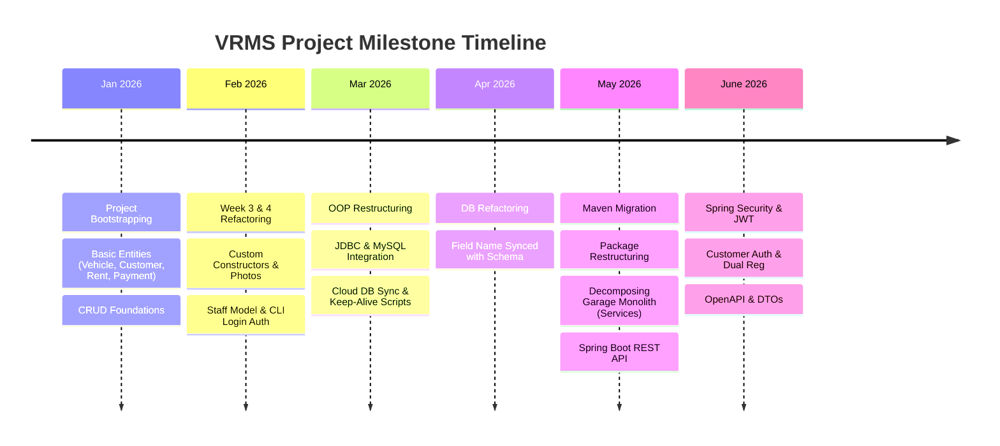

# 🕒 Project Development Timeline & Git History

This document provides a chronological timeline of the Vehicle Rental Management System (VRMS) development, detailing the contributions, feature additions, refactoring steps, and bug fixes made by each team member from the project's inception to the present.

---

## 👥 Contributors & Key Roles

*   **thangsaoly (Saoly)**: Backend Architecture, Database CRUD Sync, Aiven Cloud integration, Maven Migration, Service Layer Refactoring, and Documentation.
*   **chhi-hiro (Chhunhour)**: CRUD Operations (Vehicle/Rent), User Input Validation, Lambda-based Operations, OOP inheritance restructuring, and Login/Permission checks.
*   **davidyeat (David)**: Customer refactoring, Console password masking, input validation forms, and JDBC integration help.
*   **Noy Sokbolen (Bolen)**: Payment logic integration, validation fixes, and package structure setup.

---

## 📅 Chronological Development Timeline

### 🔹 January 2026: Project Bootstrapping & Core CRUD
*   **Jan 27, 2026**: Project initialized by **chhi-hiro** (`39e7c9d` - *new journey*).
*   **Jan 29, 2026**: **thangsaoly** implemented the baseline classes (`2ec141a`, `60dfa71`, `22beab6`):
    *   `Vehicle.java`, `Customer.java`, `Rent.java`, and `Payment.java` structural definitions.
*   **Jan 30, 2026**: CRUD operations introduced:
    *   **chhi-hiro** implemented basic Vehicle CRUD and console user input scanner (`d892f63`, `635c620`, `e8ad3b6`).
    *   **thangsaoly** implemented Customer CRUD operations (`d577fc1`).
*   **Jan 31 – Feb 1, 2026**: **thangsaoly** finalized initial Rent management logic and bug fixes (`1c232bb`, `9bfd3bb`).

### 🔹 February 2026: Refactoring, Validation, and Authentication
*   **Feb 2 – 3, 2026**: **Noy Sokbolen** implemented payment processing (`f1cff74`). **thangsaoly** and **chhi-hiro** refactored core constructors for Week 3 and added daily price validations (`befd695`, `4613b1c`).
*   **Feb 5, 2026**: **thangsaoly** added payment status tracking, ID/Driver's license photos fields to Customer, and created the `paymentManagement` loop (`ce3deed`, `27a4331`).
*   **Feb 9 – 10, 2026**: Refactoring of Customer and Payment:
    *   **davidyeat** refactored Customer properties for Week 4 (`78ae7e4`, `e3ecefb`).
    *   **Noy Sokbolen** updated return logic and payment verification (`4ef7758`, `eff9156`).
    *   **chhi-hiro** updated vehicle helpers and encapsulation (`0ff0dcc`, `64734a2`, `552f06f`).
*   **Feb 16 – 17, 2026**: Staff model introduction:
    *   **thangsaoly** added `Staff.java` and replaced primitive arrays with dynamic `ArrayList` (`4429f8e`, `200d5cd`, `87fd01e`).
*   **Feb 21, 2026**: **thangsaoly** integrated Staff interfaces and roles (`9d7e9e2`).
*   **Feb 23 – 24, 2026**: Login & Permissions:
    *   **davidyeat** updated staff/manager structure and added Customer HashSet tracking (`e387343`, `ee1641c`).
    *   **chhi-hiro** implemented the `IVehicle` interface and login/permission checking within CLI menus (`0010311`, `2d26f78`, `d5ee5f9`).
    *   **thangsaoly** added the secure login UI, permissions, logout flows, Car/Motorcycle inheritance, and history logging (`83426fb`, `3c16432`, `2563680`).

### 🔹 March 2026: OOP Structuring & Database Integration
*   **Mar 2 – 3, 2026**:
    *   **chhi-hiro** refactored vehicle lists to base class references (`3033aac`, `2eec526`, `5cf83ee`).
    *   **thangsaoly** introduced `RegularStaff.java` subclass (`23f9143`).
    *   **Noy Sokbolen** structured classes into packages (`e66a701`).
*   **Mar 6 – 10, 2026**: OOP abstraction improvements:
    *   **chhi-hiro** moved business logic like `canBeRented` into `Garage.java` (`662998d`) and refined salary/polymorphism rules (`8a47831`, `4b3d0b2`).
    *   **thangsaoly** changed `Staff` and `Vehicle` to formal abstract classes (`31abc31`, `a928745`).
*   **Mar 16 – 18, 2026**: Connecting DB & Lambda expressions:
    *   **chhi-hiro** implemented lambda expressions for Vehicle filtering (`dcebbd5`, `77564da`).
    *   **davidyeat** added the initial MySQL JDBC connector (`13a2f89`).
    *   **thangsaoly** configured the remote Aiven cloud database (`e254aee`).
*   **Mar 23 – 24, 2026**: Validation & Console Masking:
    *   **chhi-hiro** & **Noy Sokbolen** improved input validation and global exception handling (`40ed8e9`, `8e108de`, `10a09b0`).
    *   **davidyeat** implemented masked password inputs via `java.io.Console` (`9190158`).
    *   **thangsaoly** added a background script to prevent the Aiven DB from sleeping (`bbee38c`).
*   **Mar 25 – 26, 2026**: Full Sync & Models Integration:
    *   **thangsaoly** implemented complete CRUD sync between memory states and the MySQL database (`eaed0fd`, `ef71038`).
    *   **chhi-hiro** integrated `Staff` into `Rent` / `RentRecord` DB mappings (`c113747`).
*   **Mar 28 – 31, 2026**: **thangsaoly** optimized database connections, added Rent records UI table, and restricted database syncing privileges to managers (`b14718f`, `ec685de`, `63ce0ea`).

### 🔹 April 2026: Schema Realignment
*   **Apr 3, 2026**: **thangsaoly** refactored schema names in `RentRecord` and `DatabaseMapper` (`a49f3a5`) to align `price_per_day` with `price` and `discount_pct` with `discount`.

### 🔹 May 2026: Maven Migration, Service Decomposition, and REST Foundation
*   **May 10 – 11, 2026**: **thangsaoly** documented the system with structured README instructions and proposed an upgrade plan (`0a5c566`, `39a9b90`).
*   **May 16, 2026**: **thangsaoly** migrated the codebase to **Maven** (`b1e61ae`):
    *   Adopted the standard Spring Boot folder structure (`src/main/java/com/rental/system/`).
    *   Automated JDBC and H2 dependencies through `pom.xml`.
*   **May 19, 2026**: **thangsaoly** decoupled the monolithic `Garage` controller class (`25ede8d`):
    *   Separated responsibilities into specific service components: `VehicleService`, `StaffService`, `RentalService`, and `CustomerService`.
*   **May 22, 2026**: **thangsaoly** initialized project documentation, database schema config files, and core resources (`70a77aa`).
*   **May 25, 2026**: **thangsaoly** implemented Option 7 (Other Management) features (`8a173d2`):
    *   Introduced `MaintenanceRecord`, `Promotion` (Promo Codes), and dynamic `SystemSetting` entities, services, and repositories.
*   **May 28, 2026**: **thangsaoly** migrated the application into a Spring Boot REST API (`307b6db`):
    *   Replaced in-memory lists and JDBC mapping with Spring Data JPA repositories.
    *   Introduced REST Controllers (`VehicleController`, `CustomerController`, `RentalController`, etc.) mapping standard HTTP methods.
*   **May 31, 2026**: **thangsaoly** integrated Spring Security and stateless JWT authentication (`1cf87e4`).

### 🔹 June 2026: Security Hardening, Customer Flows, and OpenAPI Documentation
*   **June 3, 2026**: **thangsaoly** added dynamic loading of default staff credentials from JSON (`1e94073`).
*   **June 6, 2026**: **thangsaoly** optimized deletion paths in controllers, secured sensitive staff outputs (hashed passwords), and corrected API routes (`7be3777`).
*   **June 7, 2026**: **thangsaoly** implemented dual registration and customer authentication flows (`e05d66f`):
    *   Added custom customer principal context and security pathways allowing customers to sign in.
*   **June 18, 2026**: **thangsaoly** finalized API usability and robust error handling (`3b0630b`):
    *   Added OpenAPI/Swagger documentation (`OpenApiConfig.java`) for easy UI-based endpoint testing.
    *   Implemented global exception handling (`GlobalExceptionHandler.java`) to standardize JSON error payloads.
    *   Integrated DTO mappings (`VehicleDTO`, `RentalDTO`) for clean presentation layers and added vehicle image assets.
