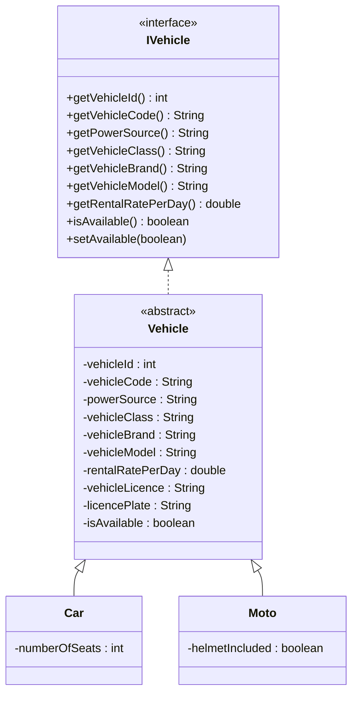
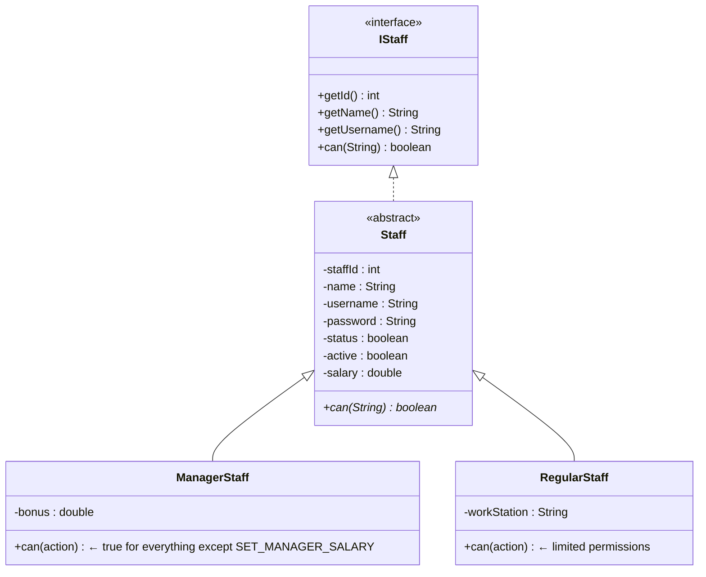

# Vehicle Rental Management System — Project Summary

> **Language:** Java (JDK 17+, text blocks, enhanced switches, and Lombok)  
> **Database:** MySQL (Aiven Cloud) via Hibernate / Spring Data JPA  
> **Architecture:** Spring Boot REST API (Stateless Controller / Service / Repository architecture)  
> **Total Source Files:** ~52 Java classes across packages

---

## 1. Package & Class Map

```
src/main/java/com/rental/system/
├── Main.java                        ← Spring Boot Application Starter & Seed Data Initializer
├── controller/                      ← REST API Controllers
│   ├── VehicleController.java       ← Fleet CRUD and filtering endpoints
│   ├── CustomerController.java      ← Customer profiles and auth endpoints
│   ├── RentalController.java        ← Active rents and return execution endpoints
│   ├── StaffController.java         ← Staff CRUD endpoints
│   ├── PromotionController.java     ← Promo codes CRUD endpoints
│   ├── MaintenanceRecordController.java ← Vehicle maintenance logs endpoints
│   └── SystemSettingController.java ← Dynamic setting values endpoints
├── service/                         ← Business Logic Services
│   ├── VehicleService.java          ← Fleet calculations, availability, and helper logic
│   ├── CustomerService.java         ← Client profile verification and signup logic
│   ├── RentalService.java           ← Rental calculations, pricing snapshots, returns
│   ├── StaffService.java            ← Staff management and default user provisioning
│   └── OtherManagementService.java  ← Maintenance logs, system configs, promo codes
├── repository/                      ← Spring Data JPA Repository Layer
│   ├── VehicleRepository.java
│   ├── CustomerRepository.java
│   ├── RentRepository.java
│   ├── RentRecordRepository.java
│   ├── StaffRepository.java
│   ├── PaymentRepository.java
│   ├── PromotionRepository.java
│   ├── MaintenanceRecordRepository.java
│   └── SystemSettingRepository.java
├── model/                           ← JPA Database Entities
│   ├── IVehicle.java                ← Vehicle interface
│   ├── Vehicle.java                 ← Abstract base class mapping fields
│   ├── Car.java                     ← Subclass adding specific car details
│   ├── Moto.java                    ← Subclass adding motorcycle details
│   ├── Customer.java                ← Customer details and registered documents
│   ├── Rent.java                    ← Active rental records
│   ├── RentRecord.java              ← Completed/archived rentals (snapshot design)
│   ├── Payment.java                 ← Payment calculations (discount, penalties, damages)
│   ├── SystemSetting.java           ← Tax and late fee configurations
│   ├── MaintenanceRecord.java       ← Vehicle upkeep logs
│   └── Promotion.java               ← Promotion codes
├── user/                            ← RBAC User Definitions
│   ├── IStaff.java                  ← Staff interface
│   ├── Staff.java                   ← Abstract base Staff class
│   ├── ManagerStaff.java            ← Manager role (full system permissions)
│   ├── RegularStaff.java            ← Staff role (limited system permissions)
│   └── CustomerStaff.java           ← Customer principal user implementation
├── security/                        ← Spring Security & JWT Implementation
│   ├── JwtAuthenticationFilter.java ← Token interceptor and context loader
│   ├── JwtTokenProvider.java        ← Token generator and validator
│   ├── StaffPrincipal.java          ← Principal mappings for Staff
│   ├── CustomerPrincipal.java       ← Principal mappings for Customers
│   ├── StaffUserDetailsService.java ← Details loader for Staff logins
│   └── CustomerUserDetailsService.java ← Details loader for Customer logins
├── dto/                             ← Data Transfer Objects
│   ├── VehicleDTO.java              ← Client representation for Vehicles
│   ├── RentalDTO.java               ← Client representation for Rents
│   └── ErrorResponse.java           ← Consistent error format
├── config/                          ← Infrastructure & Configuration
│   ├── SecurityConfig.java          ← Routing paths and security configuration
│   ├── OpenApiConfig.java           ← Swagger/OpenAPI interactive API setup
│   └── SystemSettingsHolder.java    ← Fast caching layer for settings
└── exception/                       ← Exception Mappings
    ├── ResourceNotFoundException.java
    └── GlobalExceptionHandler.java  ← Unified controller advice for errors
```

---

## 2. Inheritance & Interface Hierarchy

### Vehicle Hierarchy


### Staff Hierarchy


---

## 3. Data Persistence (Spring Data JPA)

The system replaces raw SQL scripts and JDBC helper queries with Spring Data JPA. Database relations are mapped as follows:

- **Inheritance Mapping**: The `Vehicle` abstract parent maps subclasses `Car` and `Moto` into a single SQL table (`vehicles`) using `@Inheritance(strategy = InheritanceType.SINGLE_TABLE)` and `@DiscriminatorColumn`.
- **Entity Associations**:
  - `Rent` holds `@ManyToOne` references to `Vehicle`, `Customer`, and `Staff`, and a `@OneToOne` reference to `Payment`.
  - `RentRecord` (snapshot) holds details denormalized in a single table for performance and history protection.
  - `MaintenanceRecord` holds `@ManyToOne` reference to `Vehicle`.

---

## 4. Security Framework (Spring Security + JWT)

The security layer utilizes a dual-pathway authentication framework allowing both system **Staff** and registered **Customers** to log in and interact with resources based on their roles:

- **Stateful Password Encryption**: Uses `BCryptPasswordEncoder` to hash passwords before storing.
- **Stateless Tokens**: Uses JWT tokens carrying authentication context in standard `Authorization: Bearer <token>` headers.
- **Access Control (RBAC)**: Endpoint route protections are configured in `SecurityConfig.java` and verified at controller levels:
  - **Managers**: Full administrative operations, settings modification, and reports.
  - **Staff**: Manage rentals, check in/out vehicles, and lookup client records.
  - **Customers**: Browse available vehicles and view personal rental histories.

---

## 5. REST Endpoints Overview

| Component | Path | Methods | Description |
|---|---|---|---|
| **Vehicles** | `/api/vehicles` | `GET`, `POST`, `PUT`, `DELETE` | Fleet management, sorting, and availability checks |
| **Customers** | `/api/customers` | `GET`, `POST`, `PUT`, `DELETE` | Signup, login, profiles, and license uploads |
| **Rentals** | `/api/rentals` | `GET`, `POST`, `DELETE` | Initialize rental bookings and process returns |
| **Staff** | `/api/staff` | `GET`, `POST`, `PUT`, `DELETE` | Employee management and login endpoints |
| **Promotions** | `/api/promotions` | `GET`, `POST`, `DELETE` | Promo code configurations |
| **Maintenance** | `/api/maintenance` | `GET`, `POST`, `DELETE` | Logging service and repairs on vehicles |
| **Settings** | `/api/settings` | `GET`, `PUT` | System settings (Tax rates, penalty calculations) |

---

## 6. Architecture Data Flow

```
   ┌──────────────┐         HTTP Request (JWT)         ┌──────────────────┐
   │ Client (Web) │ ─────────────────────────────────► │ REST Controller  │
   └──────────────┘ ◄───────────────────────────────── └──────────────────┘
           │                JSON Payload / DTOs                  │
           │                                                     ▼
           │                                           ┌──────────────────┐
           │                                           │  Service Layer   │
           │                                           └──────────────────┘
           │                                                     │
           ▼                                                     ▼
   ┌──────────────┐          SQL Queries / Entities    ┌──────────────────┐
   │    MySQL     │ ◄───────────────────────────────── │ Repository (JPA) │
   └──────────────┘                                    └──────────────────┘
```

* **Interactive Documentation:** Available locally via `/swagger-ui.html` using OpenAPI configurations.
* **Seed Loaders:** System settings, mock employees, vehicles, and client records are provisioned dynamically on application boot through `CommandLineRunner` in `Main.java`.
