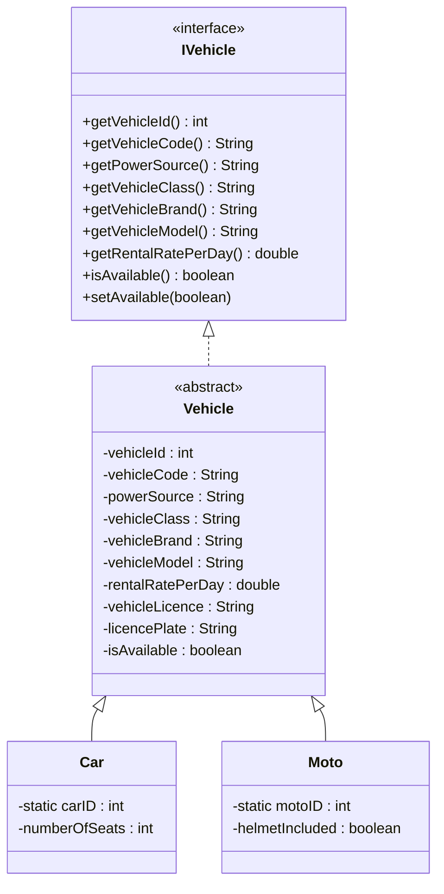
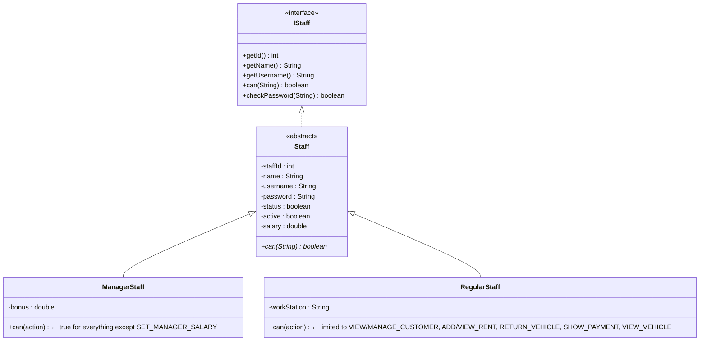

# Vehicle Rental Management System — Project Summary

> **Language:** Java (JDK 17+, uses text blocks & enhanced switch)  
> **Database:** MySQL (Aiven cloud) via JDBC  
> **Architecture:** Console-based MVC — Model / User / Controller / Database layers  
> **Total source files:** 17 Java classes across 4 packages

---

## 1. Package & Class Map

```
src/
├── Main.java                        ← Entry point (login + main menu loop)
├── controller/
│   └── Garage.java                  ← Central controller (~2 017 lines)
├── model/
│   ├── IVehicle.java                ← Interface: vehicle contract
│   ├── Vehicle.java                 ← Abstract class implementing IVehicle
│   ├── Car.java                     ← Concrete: extends Vehicle
│   ├── Moto.java                    ← Concrete: extends Vehicle
│   ├── Customer.java                ← Customer entity
│   ├── Rent.java                    ← Active rental record
│   ├── RentRecord.java             ← Immutable snapshot of completed rental
│   └── Payment.java                 ← Payment entity with calculation logic
├── user/
│   ├── IStaff.java                  ← Interface: staff contract
│   ├── Staff.java                   ← Abstract class implementing IStaff
│   ├── ManagerStaff.java            ← Concrete: full access (except SET_MANAGER_SALARY)
│   └── RegularStaff.java            ← Concrete: limited permissions
└── database/
    ├── MySQLConnection.java         ← Singleton JDBC connection manager
    └── DatabaseMapper.java          ← ORM-like mapper: ResultSet ↔ Java objects + CRUD
```

---

## 2. Inheritance & Interface Hierarchy

### Vehicle Hierarchy



### Staff Hierarchy



---

## 3. Functional Interfaces (Lambda / Anonymous Classes)

| Interface | Location | Purpose |
|---|---|---|
| `VehicleFilter` | `Garage.java:9-12` | `@FunctionalInterface` — used with lambdas to filter vehicles by model, price, power, class, type |
| `StaffFilter` | `Garage.java:14-17` | `@FunctionalInterface` — used with anonymous classes to filter staff by role (Regular / Manager / All) |

---

## 4. Collections Used

| Collection | Type | Stored In | Purpose |
|---|---|---|---|
| `garage` | `ArrayList<Vehicle>` | `Garage` | All vehicles (Cars + Motos) |
| `customers` | `HashSet<Customer>` | `Garage` | All registered customers (unique by idNum + phone) |
| `staffs` | `HashSet<Staff>` | `Garage` | All staff members (unique by staffId + username) |
| `rents` | `ArrayList<Rent>` | `Garage` | Active/current rental records |
| `rentalHistory` | `ArrayList<RentRecord>` | `Garage` | Immutable snapshots of completed rentals |
| `carClasses`, `motoClasses`, `carBrands`, `motoBrands`, `powerSources` | `ArrayList<String>` | `Garage` | Predefined option lists for vehicle creation |

---

## 5. Key Classes — Detailed Breakdown

### 5.1 `Main.java` — Entry Point
- Creates `Garage(10)`, handles staff login via `staffLogin()`, runs the main menu loop.
- Supports password masking via `System.console()` with IDE fallback.

### 5.2 `Garage.java` — Central Controller (~2 017 lines)

**Role:** Single controller orchestrating all business logic, UI interaction, and database synchronization.

#### Action Constants (RBAC)
```
VIEW_VEHICLE, MANAGE_VEHICLE, VIEW_CUSTOMER, MANAGE_CUSTOMER,
VIEW_RENT, ADD_RENT, RETURN_VEHICLE, SHOW_PAYMENT,
MANAGE_STAFF, VIEW_REPORTS, SET_MANAGER_SALARY
```

#### Management Modules

| Module | Menu Method | CRUD Operations |
|---|---|---|
| **Vehicle** | `vehicleManagement()` | `addVehicle()`, `showVehicle()`, `updateVehicle()`, `removeVehicle()`, `printVehiclesByFilter()` |
| **Customer** | `customerManagement()` | `addCustomer()`, `showCustomers()`, `updateCustomer()`, `removeCustomer()` |
| **Rent** | `rentManagement()` | `addRent()`, `showRents()`, `updateRent()`, `removeRent()`, `returnVehicle()`, `lookupCompletedRent()` |
| **Payment** | `paymentManagement()` | `showPayment()`, `updatePayment()` |
| **Staff** | `staffManagement()` | `addStaff()`, `showStaffs()`, `updateStaff()`, `removeStaff()` |
| **Report** | `reportManagement()` | `showRentalHistory()`, `generateReport()` |

#### Authentication & Authorization
- `staffLogin(username, password)` — iterates `staffs`, validates credentials, sets `loggedInStaff`.
- `staffLogout()` — clears session.
- `requireStaffLogin()` — guard check before every operation.
- `loggedInStaff.can(ACTION)` — polymorphic permission check.

#### Super Admin
- `addAdmin("Admin", "admin_root", "root123")` — creates an anonymous `ManagerStaff` subclass where `can()` always returns `true`.

#### Dashboard
- `showDashboard()` — displays vehicle/customer counts, active/completed rents on login.

#### Full Report (`generateReport()`)
1. Fleet summary (total/available/rented cars & motos)
2. Rental summary (active + completed)
3. Revenue summary (total + average)
4. Top rented vehicle
5. Top customer

#### Helper / Utility Methods
- `getRequiredInput()`, `getRequiredIntInput()`, `getRequiredDoubleInput()`, `getRequiredBooleanInput()` — validated console input
- `validateNameInput()` — regex-based name validation
- `selectInput(scanner, options, fieldName)` — numbered list → selection
- `isValidDateFormat()` — regex `dd-MM-yyyy`
- `findVehicle()` — dual verification by ID + code
- `findStaff()` — verification by ID + username
- `findCustomerByID()` — lookup by numeric ID
- `filterVehicle(VehicleFilter)` — generic filter with lambda
- `showFilteredStaffs(StaffFilter)` — generic filter with anonymous class
- `canBeRented(Customer, Vehicle)` — eligibility check (checks availability + required documents)

#### DB Startup Initialization
```
loadVehiclesFromDatabase()     → SELECT * FROM vehicles
loadCustomersFromDatabase()    → SELECT * FROM customers
loadStaffsFromDatabase()       → SELECT * FROM staffs    (+ ensures super-admin exists)
loadRentsFromDatabase()        → SELECT * FROM rents     (joins with payments, vehicles, customers, staffs)
loadRentsHistoryFromDatabase() → SELECT * FROM rent_records
```
Each method falls back to in-memory seed data (`generateVehicleToGarage()`, `generateCustomerToSystem()`, `generateStaffToSystem()`) if the DB is unreachable or empty.

### 5.3 `Vehicle.java` — Abstract Base
- Fields: `vehicleId`, `vehicleCode`, `powerSource`, `vehicleClass`, `vehicleBrand`, `vehicleModel`, `rentalRatePerDay`, `vehicleLicence`, `licencePlate`, `isAvailable`
- Auto-generates `vehicleId` from `Garage.getVehicleID() + 1` and `vehicleCode` as `"Car-N"` / `"Moto-N"`
- Overrides `hashCode()` based on `vehicleId + licencePlate`

### 5.4 `Car.java`
- Extra field: `numberOfSeats` (defaults to 4 if ≤ 0)
- Static counter: `carID` for type-based code generation
- `equals()` uses `vehicleCode` + `licencePlate`

### 5.5 `Moto.java`
- Extra field: `helmetIncluded`
- Static counter: `motoID`
- Same `equals()` pattern as `Car`

### 5.6 `Customer.java`
- Fields: `customerId`, `customerName`, `customerIdNum`, `customerPhone`, `IDCardPhoto`, `DriverLicensePhoto`
- Phone validation: `^[0-9]{9,10}$` regex + uniqueness check against existing `HashSet<Customer>`
- `equals()` / `hashCode()` based on `customerIdNum + customerPhone`

### 5.7 `Rent.java`
- Composition: holds references to `Vehicle`, `Customer`, `Payment`, `Staff`
- Fields: `rentId`, `rentDays`, `startDate`, `endDate`, `returnDate`, `status` (true = active)
- `equals()` based on `rentId + vehicleId`

### 5.8 `RentRecord.java` — Immutable Snapshot
- `final` class with all `final` fields — 30 fields total capturing Vehicle, Customer, Staff, Rental, and Payment data
- Built from `Rent` on `returnVehicle()` or from DB via `fromResultSet(ResultSet)`
- Two constructors: one from `Rent` object, one private all-args from `ResultSet`
- No setters — getters only

### 5.9 `Payment.java`
- Fields: `paymentId`, `paymentMethod`, `rentDays`, `price`, `discount`, `extraDays`, `damageFee`, `payDate`, `status`, `deposit`
- Accepted methods: `CASH`, `CARD`, `ABA`, `ACLEDA`, `WING`, `TBD`
- Key calculations:
  - `calculateTotal()` = `(price × rentDays + price × extraDays) × (1 - discount/100) + damageFee - deposit`
  - `expectedTotal()` = `price × rentDays - deposit`
- `processPayment(method, payDate)` finalizes payment

### 5.10 `Staff.java` — Abstract Base
- Fields: `staffId`, `name`, `username`, `password`, `status` (employed), `active` (online), `salary`
- `abstract can(String action)` — implemented by subclasses
- `checkPassword()` — plain-text comparison
- `equals()` / `hashCode()` based on `staffId + username`

### 5.11 `ManagerStaff.java`
- Extra field: `bonus`
- `can()` returns `true` for all actions **except** `SET_MANAGER_SALARY`

### 5.12 `RegularStaff.java`
- Extra field: `workStation`
- `can()` permits: `VIEW_VEHICLE`, `VIEW_CUSTOMER`, `MANAGE_CUSTOMER`, `ADD_RENT`, `VIEW_RENT`, `RETURN_VEHICLE`, `SHOW_PAYMENT`

---

## 6. Database Layer

### 6.1 `MySQLConnection.java` — Singleton Connection
- Reads `DB_URL`, `DB_USERNAME`, `DB_PASSWORD` from environment variables
- Methods:
  - `getConnection()` — lazy singleton
  - `executeQuery(sql)` — for `SELECT`
  - `executeUpdate(sql)` — for `INSERT/UPDATE/DELETE`
  - `executeInsertAndGetId(sql)` — returns auto-incremented PK

### 6.2 `DatabaseMapper.java` — ORM Utility (~535 lines)

| Category | Methods |
|---|---|
| **Map (Read)** | `mapToCustomers()`, `mapToStaff()`, `mapToVehicles()`, `mapToPayments()`, `mapToRents()`, `mapToRentRecords()` |
| **Save (Create)** | `saveNewCustomer()`, `saveNewStaff()`, `saveNewVehicle()`, `saveNewPayment()`, `saveNewRent()`, `saveNewRentRecord()` |
| **Update** | `updateVehicle()`, `updateCustomer()`, `updateStaff()`, `updateRent()`, `updatePayment()` |
| **Delete** | `deleteVehicle()`, `deleteCustomer()`, `deleteStaff()`, `deleteRent()`, `deletePayment()` |

All `save*` methods use `executeInsertAndGetId()` to capture the DB-generated PK and sync it back to the Java object via setters (e.g., `customer.setCustomerId(generatedId)`).

`mapToRents()` accepts pre-loaded collections (`allVehicles`, `allCustomers`, `allStaff`, `allPayments`) to resolve foreign key relationships by iterating and matching IDs.

---

## 7. Database Tables

| Table | Primary Key | Purpose |
|---|---|---|
| `vehicles` | `vehicle_id` (AI) | Car + Moto records (type-discriminated) |
| `customers` | `customer_id` (AI) | Customer registration data |
| `staffs` | `staff_id` (AI) | Staff accounts (role-discriminated) |
| `rents` | `rent_id` (AI) | Active/historical rental links |
| `payments` | `payment_id` (AI) | Payment details per rent |
| `rent_records` | (composite) | Denormalized immutable snapshot of completed rentals |

---

## 8. Key OOP Concepts Demonstrated

| Concept | Where |
|---|---|
| **Abstraction** | `Vehicle` (abstract), `Staff` (abstract) |
| **Interfaces** | `IVehicle`, `IStaff`, `VehicleFilter`, `StaffFilter` |
| **Inheritance** | `Car extends Vehicle`, `Moto extends Vehicle`, `ManagerStaff extends Staff`, `RegularStaff extends Staff` |
| **Polymorphism** | `staff.can(action)` — different behavior per subclass; `VehicleFilter` lambdas |
| **Encapsulation** | Private fields + getters/setters with validation in all model classes |
| **Composition** | `Rent` holds `Vehicle`, `Customer`, `Payment`, `Staff` |
| **Immutability** | `RentRecord` — all `final` fields, no setters |
| **Functional Interfaces** | `VehicleFilter`, `StaffFilter` with `@FunctionalInterface` |
| **Anonymous Inner Class** | Super-admin `ManagerStaff` in `addAdmin()`, `StaffFilter` instances in `showStaffs()` |
| **Lambda Expressions** | `filterVehicle(v -> v.getVehicleModel().equalsIgnoreCase(input))` |
| **Static Members** | ID counters (`vehicleID`, `carID`, `motoID`, `countCustomerId`, `countRentId`, `staffCount`) |
| **Singleton Pattern** | `MySQLConnection.getConnection()` |
| **RBAC (Role-Based Access Control)** | Action constants + `can()` method per staff role |

---

## 9. Data Flow Summary

```
┌─────────┐    login     ┌────────────┐   CRUD    ┌──────────────┐   JDBC    ┌───────┐
│  Main   │ ──────────►  │   Garage   │ ────────► │ DatabaseMapper│ ────────► │ MySQL │
│ (CLI)   │ ◄──────────  │ (Controller│ ◄──────── │  (ORM Utility)│ ◄──────── │  (DB) │
└─────────┘   menus      └────────────┘  objects   └──────────────┘  ResultSet └───────┘
                               │
                    ┌──────────┼──────────┐
                    ▼          ▼          ▼
              ArrayList   HashSet    HashSet
              <Vehicle>  <Customer>  <Staff>
                    │          │          │
                    ▼          ▼          ▼
              ArrayList  ArrayList
               <Rent>   <RentRecord>
```

**Startup:** DB → `DatabaseMapper.mapTo*()` → In-memory collections  
**Runtime CRUD:** User action → Garage method → Modify in-memory + `DatabaseMapper.save*/update*/delete*()` → DB  
**Fallback:** If DB is empty/unreachable → `generate*ToSystem()` methods seed default data

---

## 10. Project Statistics

| Metric | Value |
|---|---|
| Total `.java` files | 17 |
| Total lines of code | ~4 500+ |
| Largest file | `Garage.java` (2 017 lines) |
| Packages | 4 (`controller`, `model`, `user`, `database`) |
| Interfaces | 4 (`IVehicle`, `IStaff`, `VehicleFilter`, `StaffFilter`) |
| Abstract classes | 2 (`Vehicle`, `Staff`) |
| Concrete classes | 8 (`Car`, `Moto`, `Customer`, `Rent`, `RentRecord`, `Payment`, `ManagerStaff`, `RegularStaff`) |
| Utility classes | 2 (`MySQLConnection`, `DatabaseMapper`) |
| DB tables | 6 |
| CRUD operations | Full (Create/Read/Update/Delete) for all entities |
